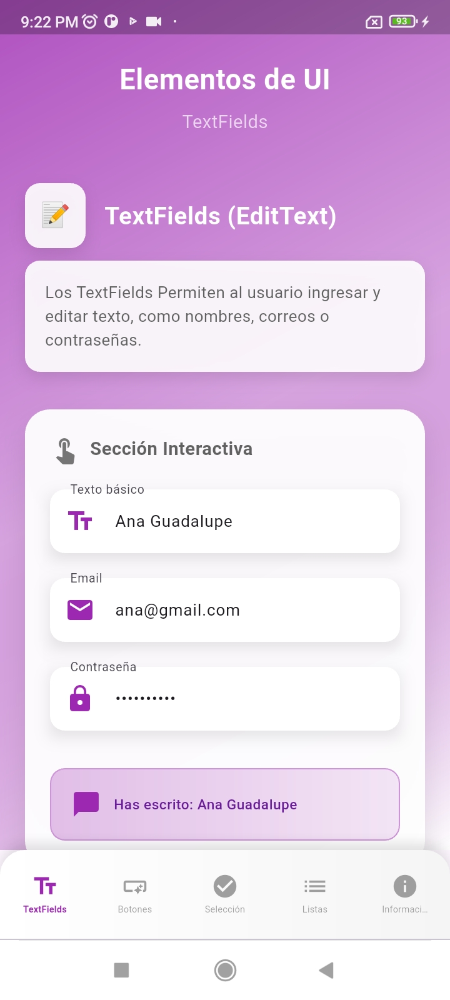
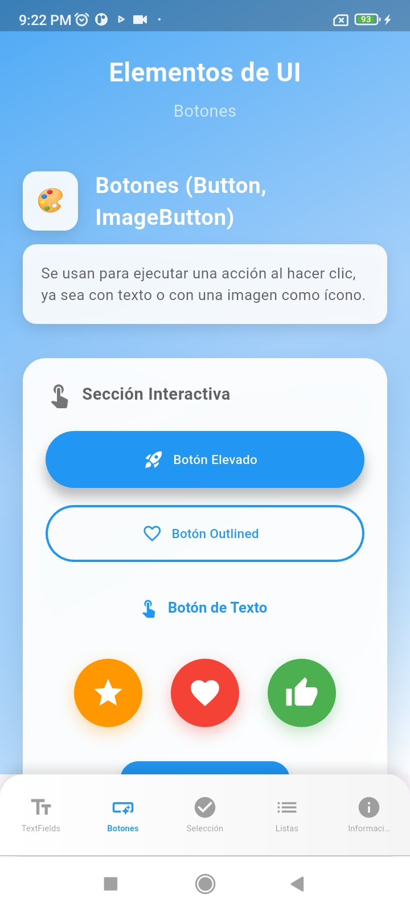
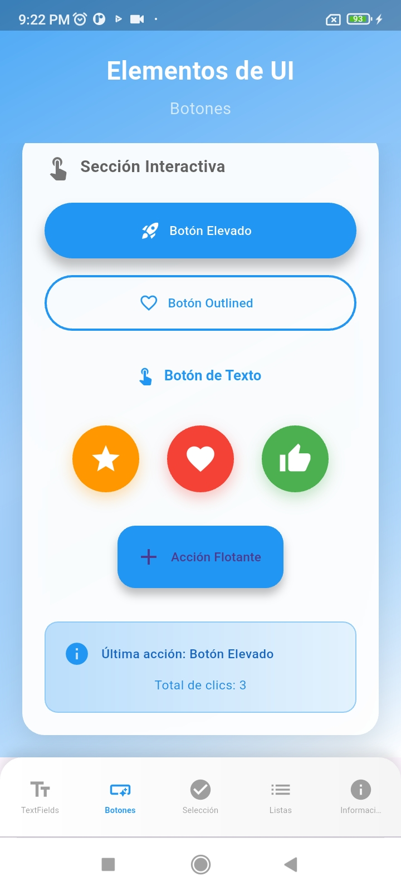
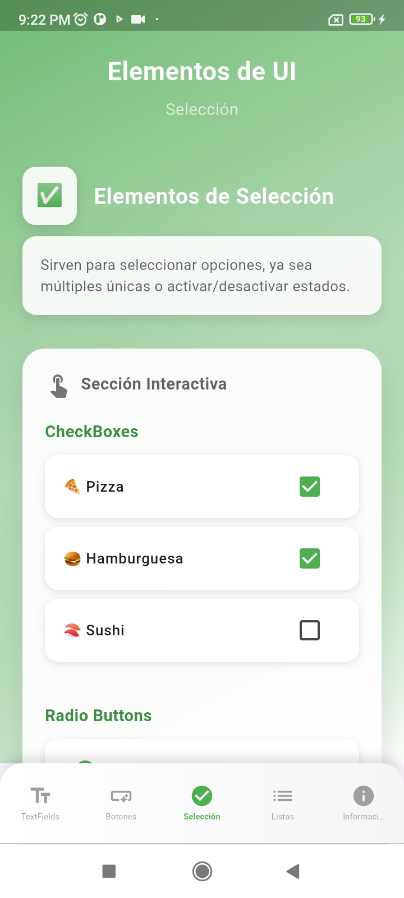
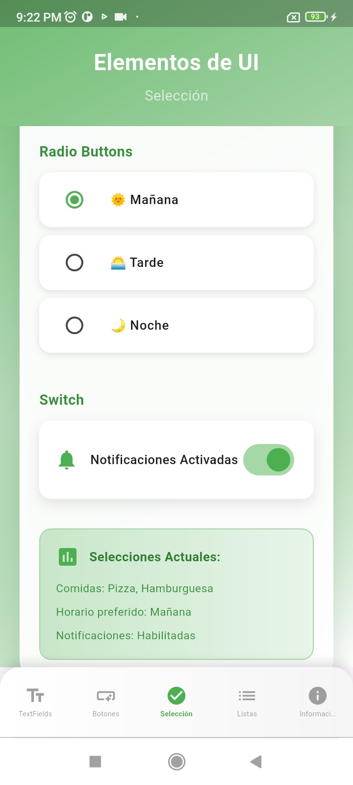
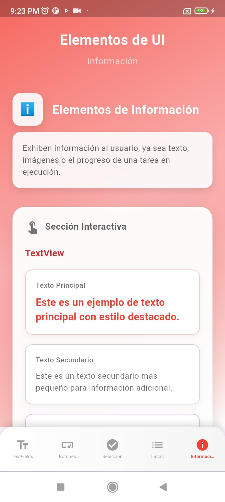
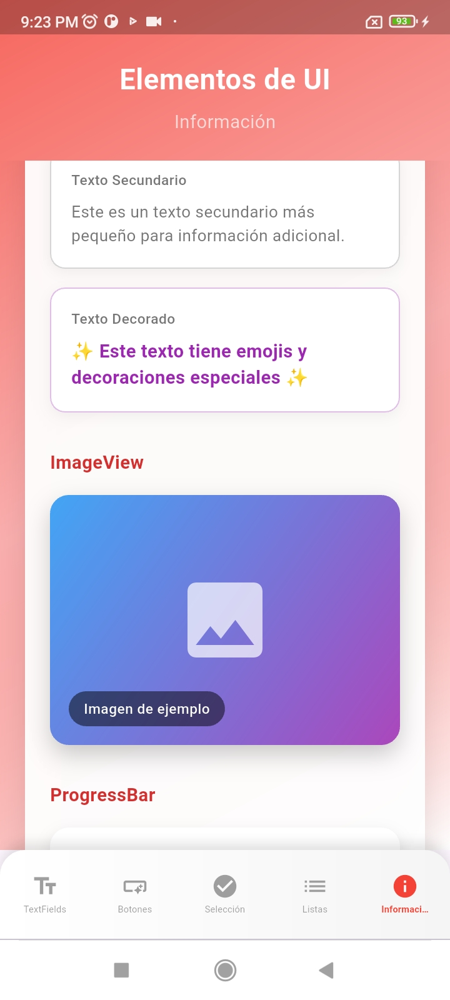
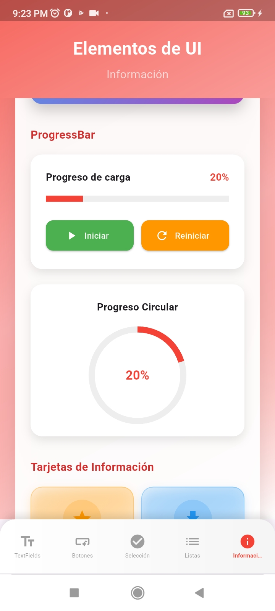
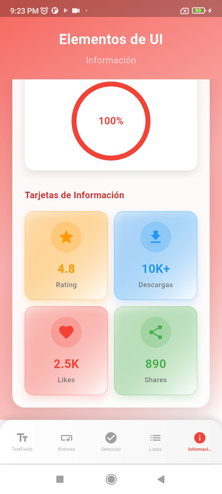

# 📱 Práctica 1: "Instalación y Funcionamiento de los Entornos Móviles"


---

## 🎯 Descripción del Proyecto

**UI Elements** es una aplicación móvil desarrollada en Flutter que sirve como guía interactiva para aprender sobre los principales elementos de interfaz de usuario en el desarrollo móvil. La app está estructurada en cinco secciones principales, cada una dedicada a explicar y demostrar diferentes componentes de UI de manera práctica.

### Características Principales

-  **Interfaz intuitiva** con navegación fluida entre secciones
-  **Demos interactivas** para cada elemento de UI
-  **Rendimiento optimizado** con transiciones suaves

---

## 🏗️ Estructura de la Aplicación

### 📋 Secciones Principales

| Sección | Elementos | Descripción |
|---------|-----------|-------------|
| **TextFields** | `EditText` | Campos de entrada de texto con validaciones |
| **Botones** | `Button`, `ImageButton` | Diferentes tipos de botones interactivos |
| **Selección** | `Checkbox`, `RadioButton`, `Switch` | Elementos para selecciones y opciones |
| **Listas** | `ListView`, `RecyclerView` | Visualización de datos en listas y grillas |
| **Información** | `TextView`, `ImageView,`, `ProgressBar` | Elementos para mostrar información |

---

## 🚀 Instalación y Configuración

### Prerrequisitos

Antes de ejecutar la aplicación, asegúrate de tener instalado:

-  **Flutter SDK** (versión 3.0 o superior)
-  **Android Studio** o **VS Code** con extensiones de Flutter
-  **Emulador Android** o dispositivo físico
-  **Git** para clonar el repositorio

### Pasos de Instalación

1. **Clona el repositorio**
   ```bash
   https://github.com/Ana-gon03/Practica01_instalacion.git
   cd ui-elements-flutter
   ```

2. **Instala las dependencias**
   ```bash
   flutter pub get
   ```

3. **Verifica la configuración de Flutter**
   ```bash
   flutter doctor
   ```

4. **Ejecuta la aplicación**
   ```bash
   flutter run
   ```

### 🔧 Configuración del Emulador

Para crear un emulador Android:

```bash
# Listar emuladores disponibles
flutter emulators

# Iniciar emulador específico
flutter emulators --launch <emulator_id>
```

---

## 📸 Capturas de Pantalla

<div align="center">

### 🏠 Fragment 1: TextFields


### 🎛️ Fragment 2: Botones





### ☑️ Fragment 3: Elementos de selección





### 📃 Fragment 4: Listas 


### ℹ️ Fragment 5: Elementos de información









</div>

---

## 🧪 Cómo Probar la Aplicación

###  Funcionalidades a Probar

#### 📝 Sección TextFields
- [ ] Ingresar texto en diferentes campos
- [ ] Probar validaciones de formulario
- [ ] Usar campos con formato específico (email, contraseña)

#### 🎛️ Sección Botones
- [ ] Presionar diferentes tipos de botones
- [ ] Observar efectos visuales 
- [ ] Probar botones con iconos

#### ☑️ Sección Selección
- [ ] Marcar/desmarcar checkboxes
- [ ] Seleccionar opciones en radio buttons
- [ ] Alternar switches

#### 📃 Sección Listas
- [ ] Interactuar con elementos de lista

#### ℹ️ Sección Información
- [ ] Observar diferentes estilos de texto
- [ ] Ver progreso de barras de carga
- [ ] Visualizar imágenes con diferentes ajustes

---

## 🚧 Dificultades Encontradas y Soluciones

###  Problema 1: Primer Acercamiento a Flutter
**Dificultad**: Como era mi primera vez usando Flutter, no entendía conceptos básicos como widgets, estados, y la estructura de archivos.


**Solución**: 
- Dediqué tiempo extra a ver tutoriales básicos de Flutter en YouTube
- Practiqué con ejemplos simples antes de empezar el proyecto

###  Problema 2: Visualizar el Diseño Sin Experiencia
**Dificultad**: No tenía experiencia diseñando interfaces móviles y me costaba imaginar cómo se vería mi app.

**Solución**:
- Busqué inspiración en apps similares 
- Usé Material Design como guía para colores y espaciado
- Aprendí a usar Container, Padding y Column/Row para organizar elementos

###  Problema 3: La Curva de Aprendizaje de Dart
**Dificultad**: Aunque sabía programar en otros lenguajes, Dart tenía sintaxis y conceptos que no conocía.

**Lo que pasó**: Me confundían cosas como las funciones arrow (=>) , los tipos nullable (?), y cómo manejar listas. Además, no entendía bien cómo funcionaba async/await en Flutter.

**Solución**:
- Practiqué Dart antes de seguir con Flutter

---

## 🔍 Hallazgos Importantes

### 💡 Descubrimientos Técnicos

1. **Rendimiento de Flutter**
   - Flutter demuestra excelente rendimiento en animaciones y transiciones
     

2. **Sistema de Widgets**
   - La composición de widgets es más potente que la herencia
   - Los widgets inmutables simplifican el manejo del estado
   - La flexibilidad del sistema permite crear interfaces complejas fácilmente

3. **Multiplataforma**
   - El mismo código funciona perfectamente en Android e iOS
   - Facilita el mantenimiento al tener una sola base de código

---

## Video 


https://github.com/user-attachments/assets/51e87616-108a-41b0-aa30-1f6f1003b4b3


</div>
